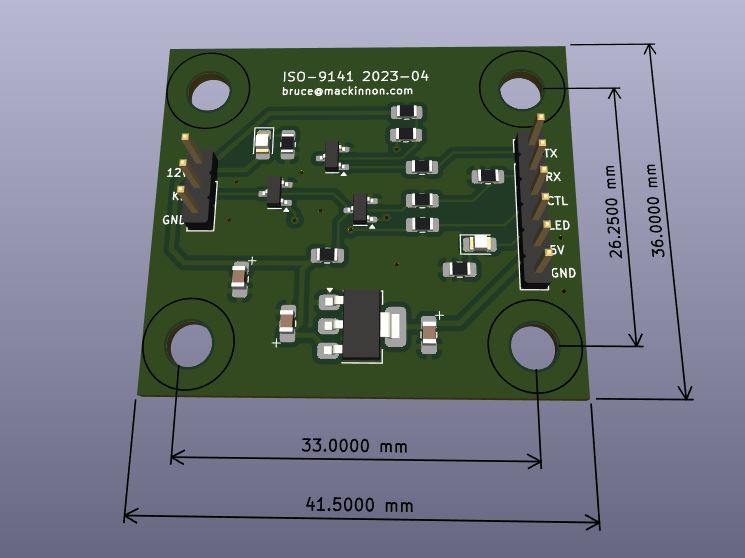
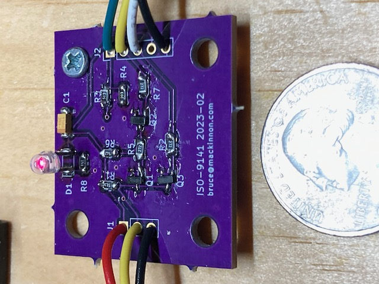

Overview
========
This is a KiCad project for a simple ISO-9141 interface board.  This allows a microcontroller to be interfaced to car's ISO-9141 (OBD2) port.

Please see related firmware projects:

* [The OBDII Reader](https://github.com/brucemack/hello-obd2)
* [The ECU Simulator](https://github.com/brucemack/ecu-sim)

[Here is the official ISO standard document](https://cdn.standards.iteh.ai/samples/16737/e6b719fd44c345a792656f6d19e6cee4/ISO-9141-1989.pdf) that explains all of the details of this interface. What makes this interesting is that the transmit/receive to/from the vehicle all happens on a single wire.

Send any questions to bruce at mackinnon dot com.

Interfaces (V2)
===============

J1 is the connection to the vehicle:
* Pin 1 - 12V battery power
* Pin 2 - KLINE
* Pin 3 - Ground

J2 is the connector to the microcontroller:
* Pin 1 - Data transmit (data from controller to vehicle)
* Pin 2 - Data receive (data from vehicle to controller)
* Pin 3 - Control line which allow the KLINE to be pulled low for the purposes of signalling
* Pin 4 - An indicator LED that can be used by the controller
* Pin 5 - +5V regulated power for controller
* Pin 6 - Ground

Hardware
========

The V2 PCB:

Here's what it looks like in real life (V1):

Connector Notes
===============

The scanner/instrument uses a SAE J1962 connector (male)
* [Cable](https://www.amazon.com/iKKEGOL-Connector-Diagnostic-Extension-Pigtail/dp/B0828YHWFG)
* [Just the Connector](https://www.sparkfun.com/products/9911)
* [Connector](https://www.amazon.com/Elecbee-Automobile-Connector-Shell-Diagnostic/dp/B0CKMSXCBY)

The vehicle uses a J1962F female connector like this: https://www.amazon.com/Goliton-Connection-Connector-Harness-Assembled/dp/B09NBWQLMQ

Copyright
=========

Copyright (C) 2024 - Bruce MacKinnon KC1FSZ

This work is covered under the terms of the GNU Public License (V3). Please consult the LICENSE file for more information.

This work is being made available for non-commercial use by the amateur radio community. Redistribution, commercial use or sale of any part is prohibited.
